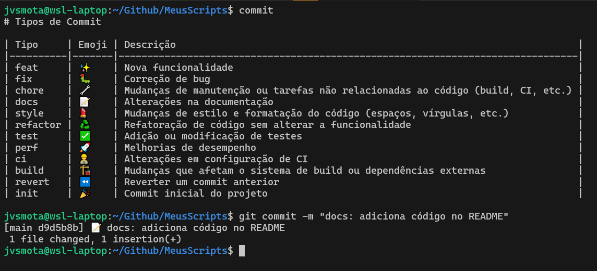

# Meus Scripts

<div align="right">
  
[](http://hits.dwyl.com/JVSMOTA/MeusScripts)

</div>

## 📝 Descrição
Aqui guardo meus scripts mais usados diariamente para ajudar na produção diária.

## 🎯 Scripts e Descrições



<div align="center">

| Script                                       | Descrição                         |
|----------------------------------------------|-----------------------------------|
| [.commit-icons.sh](scripts/.commit-icons.sh) | Adicionar emoji aos commits       |
| [.commit-types.md](scripts/.commit-types.md) | Mostrar tipos de commit possíveis |

</div>

## 🚀 Como iniciar

- Para tornar os scripts executáveis, adicione-os no diretório raiz:	

```bash
$ ls -la ~/
.commit-types.md
.commit-icons.sh
```

- Execute:

```bash
chmod +x commit-icons.sh
```

- Adicione o código abaixo no `.bashrc`:

```bash
# Alias for showing commit message types
alias commit='cat ~/.commit-types.md'

# Script to add emojis to commit message
git() {
    if [ "$1" = "commit" ] && [ "$2" = "-m" ]; then
        # Call custom commit script
        ~/.commit-icons.sh "$3"
    else
        # Use the original git command for all other cases.
        command git "$@"
    fi
}
```

- Carregue as mudanças no seu shell atual:

```bash
source ~/.bashrc
```

## 💡 Como Usar

### Usando `.commit-icons.sh`

1. Navegue até o diretório do seu projeto que está usando Git.
2. Ao fazer commits, utilize o script para adicionar automaticamente emojis de acordo com o tipo de commit. Basta seguir a estrutura de mensagem padrão:

```bash
git commit -m "<tipo>: <mensagem>"
```

   - **Exemplo:** Para adicionar uma nova funcionalidade, você pode usar:

```bash
git commit -m "feat: Adicionar nova funcionalidade de autenticação"
```

   O script `.commit-icons.sh` irá automaticamente adicionar o emoji apropriado com base no tipo de commit especificado.

### Usando `.commit-types.md`

1. Para visualizar uma lista dos tipos de commits e seus emojis associados, use o comando:

```bash
commit
```

   Isso exibirá os tipos de commit disponíveis e os emojis correspondentes para ajudá-lo a escolher o tipo certo para sua mensagem de commit.

---

### Observações

- Certifique-se de que o script `.commit-icons.sh` esteja configurado corretamente e tenha permissões de execução.
- A lista de tipos de commit e seus emojis podem ser personalizada no arquivo `.commit-types.md`.

---

Essa estrutura de uso visa garantir que suas mensagens de commit sigam uma convenção clara e padronizada, facilitando a leitura e o entendimento do histórico de commits por todos os membros da equipe.
