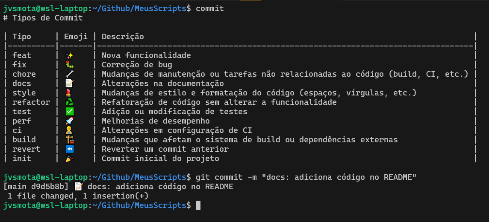

# .commit-emoji-adder

<div align="right">

[](https://hits.sh/github.com/JVSMOTA/.commit-emoji-adder/)  

</div>

## 📝 Descrição
Aqui guardo meus scripts mais usados diariamente para ajudar na produção diária.

## 🎯 Scripts e Descrições



<div align="center">

| Script               | Descrição                         |
|----------------------|-----------------------------------|
| [git](bin/git)       | Adiciona emoji aos commits        |
| [commit](bin/commit) | Mostrar tipos de commit possíveis |

</div>

## 💡 Como Usar

- Execute:

```bash
# Script to add emojis to commit message
git() {
    if [ "$1" = "commit" ] && [ "$2" = "-m" ]; then
        ~/.commit-emoji-adder/bin/git "$3"
    else
        command git "$@"
    fi
}
```

```bash
chmod +x ~/bin/git ~/bin/commit && echo 'export PATH=$PATH:~/bin' >> ~/.bashrc
```

- Carregue as mudanças no seu shell atual:

```bash
source ~/.bashrc
```

### Usando `commit-icons`

1. Navegue até o diretório do seu projeto que está usando Git.
2. Ao fazer commits, utilize o script para adicionar automaticamente emojis de acordo com o tipo de commit. Basta seguir a estrutura de mensagem padrão:

```bash
git commit -m "<tipo>: <mensagem>"
```

   - **Exemplo:** Para adicionar uma nova funcionalidade, você pode usar:

```bash
$ git commit -m "feat: Adicionar nova funcionalidade de autenticação"
[master b8a9ca2] ✨ feat: Adicionar nova funcionalidade de autenticação
 1 file changed, 0 insertions(+), 0 deletions(-)
```

   Note que o script `.commit-icons.sh` irá automaticamente adicionar o emoji apropriado com base no tipo de commit especificado.

### Usando `.commit-types.md`

1. Para visualizar uma lista dos tipos de commits e seus emojis associados, use o comando:

```bash
commit
```

   Isso exibirá os tipos de commit disponíveis e os emojis correspondentes para ajudá-lo a escolher o tipo certo para sua mensagem de commit.

---

### Observações

- Certifique-se de que o script `commit-icons` esteja configurado corretamente e tenha permissões de execução.
- A lista de tipos de commit e seus emojis podem ser personalizada no arquivo `commit-types`.

---

Essa estrutura de uso visa garantir que suas mensagens de commit sigam uma convenção clara e padronizada, facilitando a leitura e o entendimento do histórico de commits por todos os membros da equipe.
